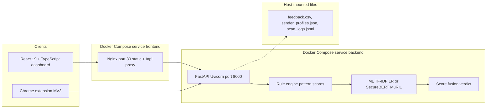
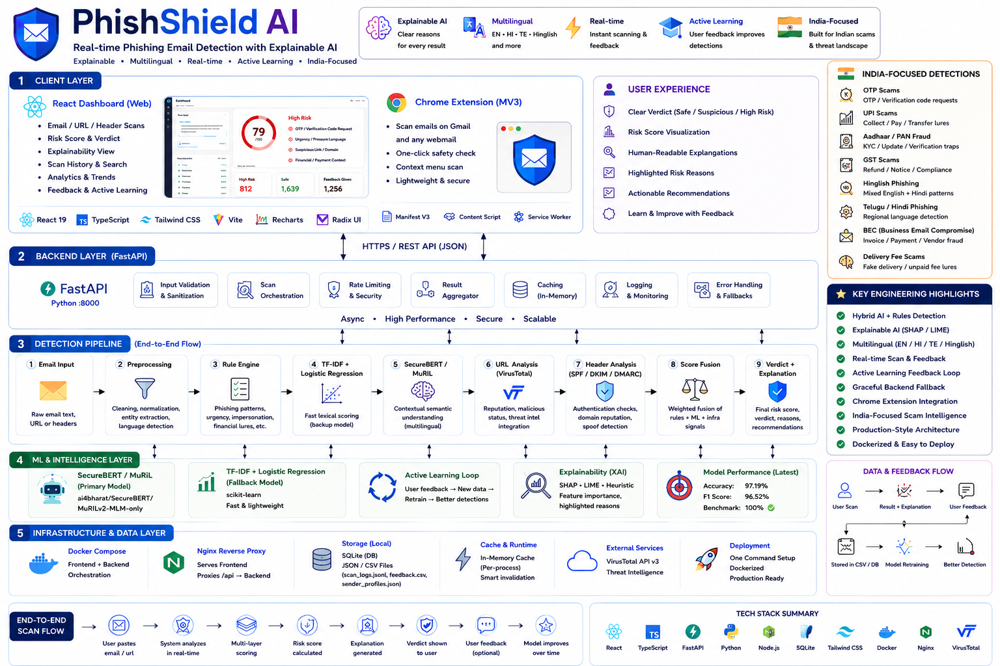
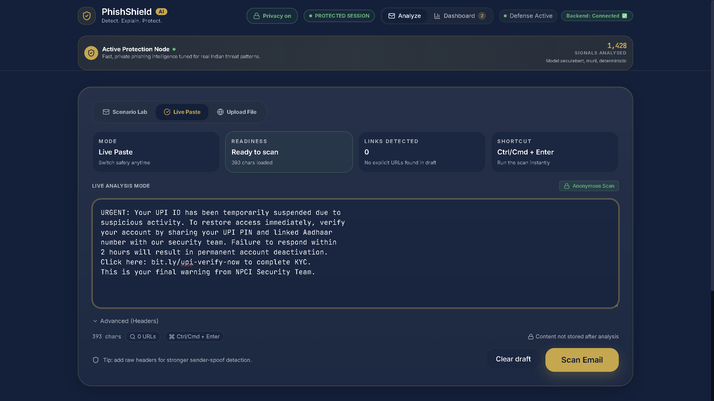
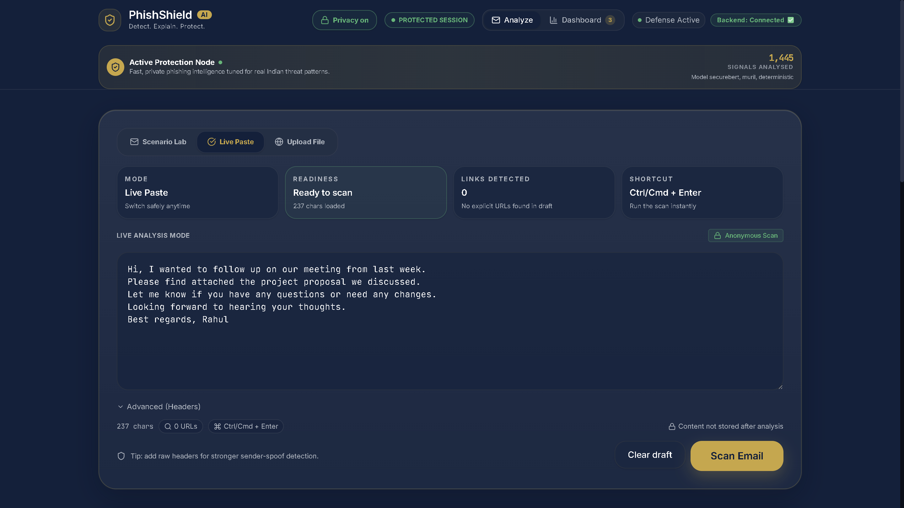
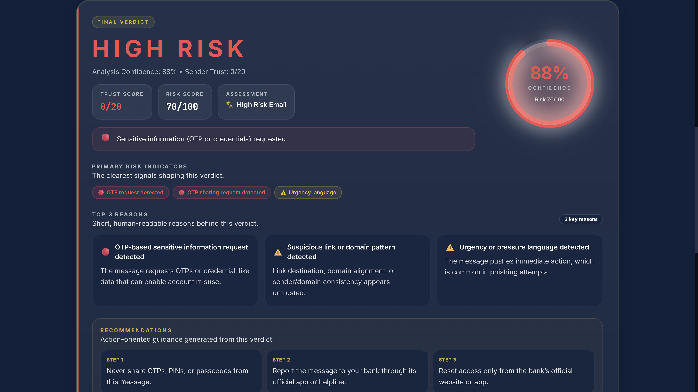
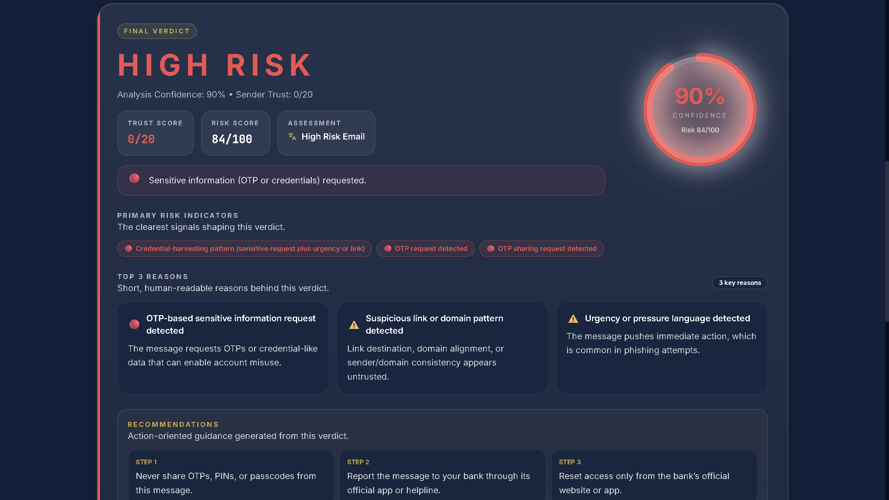
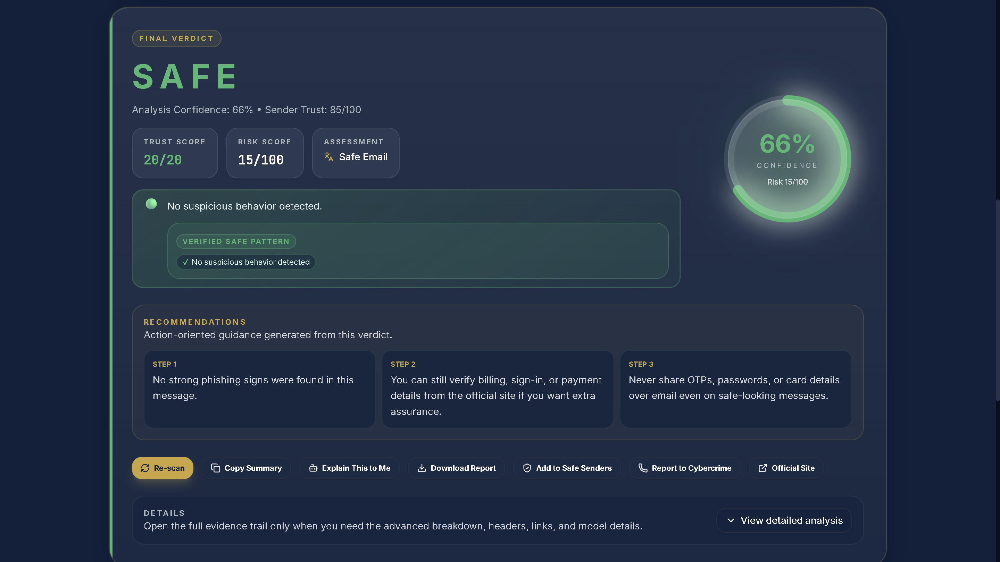
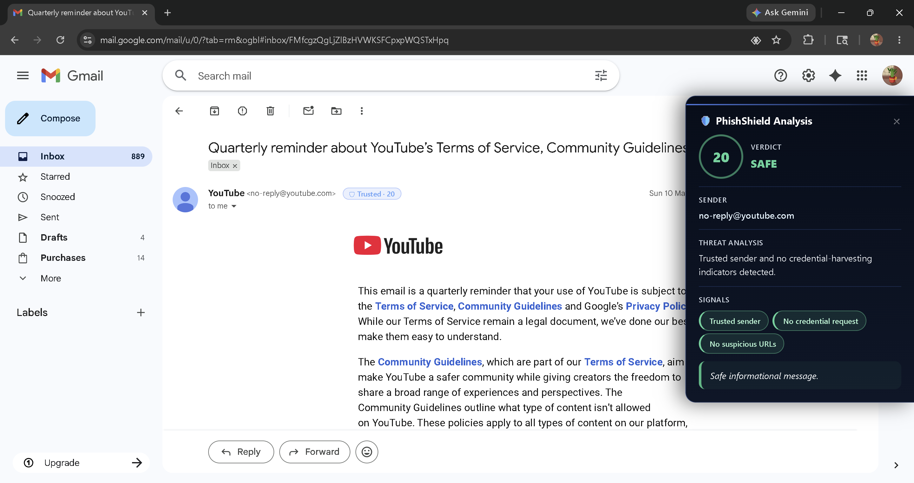

# PhishShield 🛡️


> Real-time phishing email detection with explainable scoring, multilingual checks, and a full-stack dashboard + browser extension workflow.


## Why I Built This
I kept seeing smart people around me still fall for phishing because the emails looked "normal enough."  
Most tools just say safe or unsafe, but they do not explain why in a way regular users can trust.  
I wanted to build something that catches real scam patterns we actually see here (OTP, KYC, UPI, fake bank urgency), and also shows the reasoning clearly.  
This project became my way of learning security engineering by building a product end to end, not just training a model in a notebook.

## What Does It Do?
Most of the time you paste email text straight into the app (from your inbox, a forward, or a screenshot dump) and hit scan.  
You are not clicking through a fake wizard: you bring the messy real message, and PhishShield walks it through checks in order.  
You get a risk score, a plain verdict, and short reasons you can skim in a few seconds.  
If it looks like a scam it names the vibe; if it looks fine it says so, so you are not stuck guessing.

For example, a note claiming your HDFC account is frozen until you “urgently” share the OTP for KYC over UPI can come back as **HIGH RISK** with the rule engine surfacing signals like **OTP request detected**, **Urgency language**, and **UPI handle detected**—the same kinds of reasons you see in the scan response, not a black box.

## Features

> **Chrome Extension:** Includes a Chrome Extension for in-browser scanning — paste any email directly from Gmail or any webmail tab without leaving the page.

- Scans email text and returns a risk score with verdicts like Safe, Suspicious, or High Risk.
- Uses both rule-based detection and machine-learning scoring for better phishing coverage.
- Supports multilingual scam signals (including English, Hindi, Telugu, and mixed-script patterns).
- You can run a full email scan, check a URL on its own, or paste headers for SPF-style checks when you do not have the whole message, then send feedback or fetch the stored explanation for a past scan so you are not re-pasting the same thread to understand an earlier verdict.
- Saves user feedback to improve future detections over time.
- Includes a React dashboard, TypeScript API layer, and FastAPI backend.
- Comes with Docker setup to run frontend and backend together with one command.

## Tech Stack
| Layer | Technology |
|-------|------------|
| Backend | Python, FastAPI, Uvicorn, WebSocket |
| ML Model | TF-IDF + Logistic Regression, SecureBERT/MuRIL (Transformers, Torch) |
| Frontend | React 19, Vite 7, TypeScript, Tailwind CSS |
| Database | SQLite (local dev DB), Drizzle ORM, JSON/CSV flat file stores |
| Observability | Prometheus metrics; per-scan SHAP/LIME/heuristic word attributions on `/scan-email` (SHAP times out gracefully; `explanation_degraded` when fallback) |
| DevOps | Docker, Docker Compose, Nginx, Playwright, GitHub Actions CI |

## How It Works
1. A user submits an email to scan.
2. The backend cleans the text and checks phishing patterns (urgency, impersonation, credential lures, etc.).
3. ML scoring runs (SecureBERT/MuRIL when available, with TF-IDF fallback). The transformer path runs when the machine has enough RAM or a GPU; on smaller laptops TF-IDF is picked automatically so the same request still returns a score.
4. Rule signals + ML signals are fused into one final risk score.
5. The app returns a clear verdict, confidence context, and explanation so the user knows what to do next.

## Architecture

The backend (FastAPI) handles all phishing analysis — text cleaning, rule-based pattern checks, ML inference, score fusion, and feedback storage.
The frontend (React + TypeScript) talks to the backend over a REST API and shows scan results, risk scores, and explanations in a clean dashboard UI.
Docker Compose wires both services together. Nginx serves the frontend and proxies API traffic to the backend.



### Full System Architecture



See `docs/PHISHSHIELD_COMPLETE_OVERVIEW.md` for a full deep-dive.

## Screenshots

All UI captures below are stored under `screenshots/`; each block lists the exact file path before the image.

### Dashboard — home / email paste

**Image:** `screenshots/dashboard-home-screen-scam-email-draft-01.png`  


**Image:** `screenshots/dashboard-home-screen-scam-email-draft-02.png`  


**Image:** `screenshots/dashboard-home-screen-safe-email-draft.png`  


### Dashboard — scan results

**Image:** `screenshots/dashboard-scan-results-phishing-view-01.png`  


**Image:** `screenshots/dashboard-scan-results-phishing-view-02.png`  


**Image:** `screenshots/dashboard-scan-results-safe-verdict-view.png`  


### Chrome extension

**Image:** `screenshots/chrome-extension-popup-phishshield-scan.png`  


## Getting Started

### Quick Start

The full **frontend + backend** stack is meant to come up with **one command** via **Docker Compose** from the repo root — no separate terminal per service.

```bash
git clone https://github.com/mohd-ibadullah/PhishShield.git
cd PhishShield
cp .env.example .env
docker compose up --build
```

`docker compose up --build` starts both services together (images build on first run or when Dockerfiles change).

**Docker + ML models:** Large weights are not copied into the image (see `backend/.dockerignore`). Compose mounts your local `backend/indicbert_model`, `backend/models/*`, and `model.pkl` into the container. Start **Docker Desktop** first, then run compose. First `/health` may take 1–2 minutes while transformers warm up.

**Deploy (Render etc.):** Set the same API keys as local (`HF_TOKEN`, `VT_API_KEY`, `CORS_ALLOWED_ORIGINS`, LLM keys). Without `HF_TOKEN`, the container starts in rules/TF-IDF mode until Hugging Face downloads complete — check `/health` for `securebert` / `muril` status.

There is also a **`Makefile`** at the repo root with helper targets for Docker workflows, local setup convenience (for example creating `.env` from the example), and development tasks such as running tests in the backend container — run `make help` to see the list.

Use **Prerequisites**, **Installation**, and **Running the Project** below only if you prefer a local dev setup without Docker.

### Prerequisites
- Python `3.12+` (from `backend/Dockerfile`)
- Node.js `20+` (from `frontend/Dockerfile`)
- pnpm (workspace package manager)
- Docker + Docker Compose (for containerized run)

### Installation
```bash
# 1) Clone
git clone https://github.com/mohd-ibadullah/PhishShield.git
cd PhishShield

# 2) Environment file
cp .env.example .env

# 3) Frontend workspace deps
cd frontend
pnpm install
cd ..

# 4) Backend Python deps
python -m pip install -r backend/requirements.txt
```

### Running the Project

**Docker Compose (recommended):** From the repo root, the same single command as in **Quick Start** runs the full stack — frontend and backend in one go:

```bash
# Option A: Docker — full frontend + backend with one command
docker compose up --build
```

```bash
# Option B: Local dev (two terminals)
# Terminal 1
cd backend
python -m uvicorn main:app --reload --port 8000

# Terminal 2
cd frontend
pnpm dev
```

Once running: frontend at http://localhost:5173 — API docs at http://localhost:8000/docs

## Chrome Extension

The loadable extension sources live under **`frontend/artifacts/chrome-extension/`** (Manifest V3: `manifest.json`, `background.js` service worker, `content.js`, `popup.html` / `popup.js`, and `options.html` / `options.js`).

1. Start the FastAPI backend so `http://localhost:8000` responds (for example `docker compose up --build` from the repo root, or `python -m uvicorn main:app --reload --port 8000` from `backend/`).
2. In Chrome, open `chrome://extensions/`, turn on **Developer mode**, click **Load unpacked**, and choose the `frontend/artifacts/chrome-extension/` folder.
3. Open the extension’s **Extension options** (or the options page from the extension details) and confirm **API Base URL** is `http://localhost:8000` (or your deployed API origin); use **Test Connection** if you want to verify `/health`.
4. Use the toolbar popup: manual scans `POST` to **`/scan-email`** with JSON `{"email_text": "..."}` on that same FastAPI base URL, and the background worker polls **`/health`** for status—so the extension talks to the same backend as the dashboard, not a different stack.

## Project Structure
```text
.
├── backend/                 # FastAPI app, ML logic, training and evaluation scripts
│   ├── analyze_report.py     # Prints eval summary and sample misses/false positives from data/test_report.json
│   └── certify_dataset.py    # Audits, normalizes, and writes Phishing_Email.csv → Phishing_Email_cleaned.csv
├── frontend/                # React + TypeScript workspace and extension artifacts
├── data/                    # CSV/JSON datasets and evaluation artifacts
├── tests/                   # Centralized Python test files (test_*.py)
├── pytest.ini               # Repo-root pytest config (shared by tests/ above)
├── docs/                    # Architecture diagrams and technical docs
│   └── PHISHSHIELD_COMPLETE_OVERVIEW.md  # Detailed project deep-dive
├── screenshots/             # `dashboard-*.png`, `chrome-extension-*.png` (see Screenshots section)
├── docker-compose.yml       # Root compose for backend + frontend services
└── README.md                # Recruiter-facing project overview
```

`pytest.ini` stays at the repository root on purpose: pytest discovers it automatically and applies one shared configuration to the centralized `tests/` directory, so you do not need duplicate config files next to each test package.

## Dataset
This repo contains multiple phishing datasets and curated test corpora in `data/`.  
Key visible files include:
- `data/Phishing_Email.csv` (~18,133 rows)
- `data/Phishing_Email_cleaned.csv` (~1,401 rows)
- `data/elite_emails_1000.json` (~1,020 items)
- `data/phishtank_dataset.json` (~200 items)
- `data/dataset_100.json` (80 labeled evaluation items)

Source notes in the code/docs reference curated phishing corpora plus internally cleaned and synthetic balancing steps.  
The training metadata in `data/training_meta.json` reports `rows: 18684`.

## Environment variables (runtime honesty)

| Variable | Default | Purpose |
|----------|---------|---------|
| `PHISHSHIELD_TRY_SHAP_ON_SCAN` | `0` | Set `1` to attempt SHAP on `/scan-email` (slower on CPU). Default uses fast TF-IDF linear-weights/LIME/heuristic paths. |
| `PHISHSHIELD_SHAP_TIMEOUT_SECONDS` | `2.5` | Per-SHAP attempt cap before fallback. |
| `PHISHSHIELD_SHAP_MAX_EVALS` | `64` | SHAP evaluation budget when enabled. |
| `EXPLAIN_TIMEOUT_SECONDS` | `4` | Total explainability budget per scan. |
| `PHISHSHIELD_PROVIDER_WARMUP_SECONDS` | `180` | Startup warmup timeout per transformer provider. |
| `VITE_BACKEND_URL` | — | Frontend → FastAPI base URL (e.g. `http://127.0.0.1:8000`). |

`/api/metrics` returns **offline_evaluation** (from `data/training_meta.json`) and **runtime_operational** (in-process scan counters) as separate objects — not live production accuracy.

## Results

### Offline held-out test split (TF-IDF active learning)

These numbers are the **offline benchmark** on the train/test split recorded when the model was last trained (same figures summarized in `docs/PHISHSHIELD_COMPLETE_OVERVIEW.md`).

| Metric | Value |
|--------|-------|
| Accuracy | 97.19% |
| Precision | 94.05% |
| Recall | 99.11% |
| F1 Score | 96.52% |
| Train Rows | 14,947 |
| Test Rows | 3,737 |

Source: `data/training_meta.json` (`metrics` + row counts).

### Real inbox–style check (live UI QA, May 2026)

Curated offline metrics can look stronger than what users see in a mixed real inbox. A **manual live UI run on 100 real emails** (documented in the same overview) estimated roughly **~80–85%** accuracy after hardening, with the caveat that live mail has more benign security/ops traffic and paraphrase variance than the offline split. That honest range is also stored under `live_qa` in `data/training_meta.json` for transparency.

## What I Learned
- During the live 100-email pass I watched real mail get flagged as phishing when it was just boring IT or bank security copy; that sting of a wrong red banner mattered more than squeezing another point on the offline split.
- Rule-based checks and ML together work better than either one alone for phishing edge cases.
- Data cleaning quality can change model behavior more than hyperparameter tweaks.
- End-to-end architecture (frontend + API + ML backend + deployment) is a different skill than writing isolated scripts.
- Explainability output is essential when users need to make safety decisions quickly.
- Shipping the Chrome extension taught me that UX friction is a security problem — if checking a suspicious email requires switching apps, most people skip it and that is where the real risk lives.

## Verification (local E2E, May 2026)

Manual checks on FastAPI `:8000` + React dashboard:

| Case | Expected | Result |
|------|----------|--------|
| HDFC OTP / UPI pressure | High Risk ~82 | Pass |
| Invoice / no action required | Safe ~10 | Pass |
| Netflix `netflix.com` receipt | Safe ~10 | Pass |
| Paytm reward `.xyz` + OTP | High Risk ~88 | Pass |
| Team meeting (no lure) | Safe ~10 | Pass |
| Income tax refund `.xyz` | High Risk ~75 | Pass |

Also verified: `/health` (SecureBERT/MuRIL), `/stats` (Gemini + VT active), `/check-url` (VirusTotal + allowlist), `/check-headers` (spoof signals), `/explain` (Gemini or OpenRouter), `/feedback`, `/recent-scans` (3 session items for Live Feed), `pytest` (**66 passed**).

## Future Improvements
- A live Gmail or Outlook hook is next on my list because paste-only flows still add friction for people who live inside their inbox all day, and that is where most risky threads actually land.
- I want broader Indian-language coverage and cleaner transliteration handling because mixed-script bait already shows up in the wild and the model still stumbles when the script hops mid-sentence.
- A small model and version log in the UI would help me compare runs without diffing JSON by hand; right now the honest numbers live in files and that is fine for me, not great for a teammate joining cold.
- Signed-in accounts with stored scan history belong in a serious deployment because feedback and repeat checks need a home that is not a shared CSV on disk.
- CI currently runs backend pytest, mypy, and frontend pnpm build on every push/PR via GitHub Actions; expanding to include integration tests and the Playwright UI suite would catch more regressions automatically.

## Author
**MOHD IBADULLAH**  
Full-stack developer with a security focus — I build things that solve real problems, not just demo well.  
[GitHub profile](https://github.com/mohd-ibadullah) · [LinkedIn](https://www.linkedin.com/in/mohd-ibadullah-4786b640a/)

## License
MIT License

---
📄 For technical and Docker details → [TECHNICAL_GUIDE](docs/TECHNICAL_GUIDE.md)
